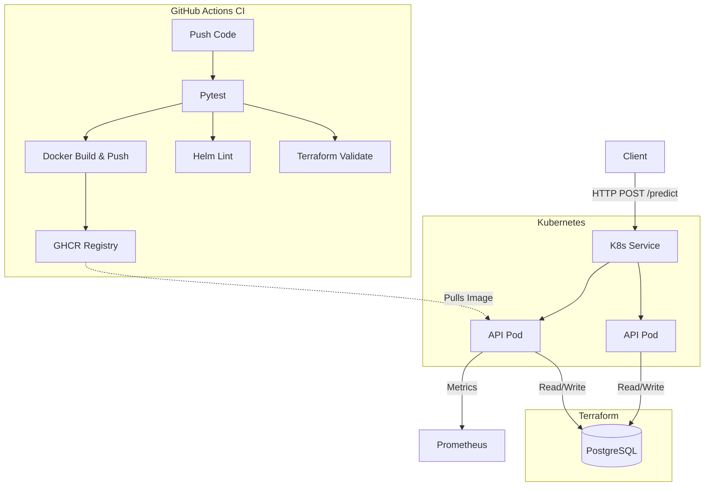

# Predictive Maintenance Pipeline


End-to-end pipeline that predicts equipment failure risk from turbofan engine sensor data (NASA C-MAPSS FD001), from raw data to a deployable prediction API. Production-hardened with Kubernetes/Helm, Terraform, and full CI/CD.

## Architecture



## What it does

Raw sensor readings → automated ETL → feature engineering → SQL storage → trained classifier → evaluated against a baseline → served as a REST API for real-time failure-risk prediction.

## Results

| Metric | Value |
|---|---|
| Model accuracy | 96.3% |
| Majority-class baseline accuracy | 86.0% |
| Model F1 (failure class) | 0.87 |
| Baseline F1 (failure class) | 0.00 |
| ROC-AUC | 0.989 |

The failure class is a minority class (~14% of rows), so a classifier that
always predicts "no failure" already scores 86% raw accuracy without
learning anything — that's the baseline row above. The model's F1 and
ROC-AUC are the numbers that actually show it learned a useful signal, not
the accuracy figure alone. Full breakdown, confusion matrix, ROC curve, and
feature importance plot are generated on each pipeline run into `results/`.

### Data leakage guard

The train/test split is done **by engine ID**, not by row. A row-wise split
would let the model see other cycles from the same engine's degradation
curve during training and be tested on it — inflating the score without
the model having learned anything generalizable. `split_by_engine()` in
`src/model.py` guarantees no engine ID appears in both sets, and this is
enforced by an assertion plus a dedicated test.

## Project structure

```
├── main.py                  # runs the full pipeline end to end
├── api.py                   # FastAPI inference service
│                              ├─ /health, /ready, /metrics, /predict
│                              ├─ OpenTelemetry distributed tracing (OTLP-exportable)
│                              ├─ request_id on every response (log correlation)
│                              └─ SIGTERM graceful shutdown handler
├── config.py                # pipeline configuration (env-var driven, validated on import)
├── src/
│   ├── extract.py           # raw file → dataframe
│   ├── transform.py         # feature engineering
│   ├── load.py              # SQLite storage + maintenance-planning query
│   ├── model.py             # train/test split, training, leakage guard
│   └── evaluate.py          # baseline comparison, plots, metrics.json
├── tests/                   # 24 tests, 97% code coverage
│   ├── test_api.py          # API endpoint + request_id uniqueness tests
│   ├── test_pipeline.py     # full E2E integration test (ETL → train → artifact)
│   └── ...                  # unit tests for every src module
├── k8s/                     # raw Kubernetes manifests (Deployment, Service, ConfigMap, Secret)
├── helm/predictive-maintenance/  # Helm chart with HPA, values.yaml + values-prod.yaml
├── terraform/               # kreuzwerker/docker provider → provisions Postgres
├── docker-compose.yml       # local dev: app + postgres with health check
├── Dockerfile               # multi-stage, non-root (appuser), pinned python:3.11.9-slim
├── .env.example             # all supported environment variables
└── .github/workflows/ci.yml # 4-job parallel CI: test → docker → helm lint → tf validate
```

## How to run

### Quick Start (Local Kubernetes)

You can run the full stack locally using `kind` and `helm`:

```bash
# 1. Provision the local Postgres database via Terraform
cd terraform
terraform init
terraform apply -auto-approve
cd ..

# 2. Start a local Kubernetes cluster
kind create cluster

# 3. Deploy the application via Helm
helm install predictive-maintenance ./helm/predictive-maintenance/

# 4. Port-forward the service to your local machine
kubectl port-forward svc/predictive-maintenance 8000:80
```

### Local Development (Python)

```bash
pip install -r requirements.txt

# Run the full pipeline: ETL → train → evaluate → save model + plots
python main.py

# Run the test suite (20 tests)
pytest tests/ -v

# Serve predictions
uvicorn api:app --reload
```

### Local Development (Docker Compose)

Bring up the app and its PostgreSQL dependency together:
```bash
docker compose up -d
```

### Calling the prediction API

`/predict` takes the last few sensor-reading cycles for an engine (at least
5, to compute rolling features) and returns a failure-risk probability:

```bash
curl -X POST http://127.0.0.1:8000/predict \
  -H "Content-Type: application/json" \
  -d '{
    "engine_id": 1,
    "readings": [
      {"op_setting_1": 0.0, "op_setting_2": 0.0, "op_setting_3": 100.0,
       "sensor_1": 518.67, "sensor_2": 642.1, "sensor_3": 1583.8,
       "sensor_4": 1396.6, "sensor_5": 14.62, "sensor_6": 21.6,
       "sensor_7": 553.9, "sensor_8": 2388.0, "sensor_9": 9046.2,
       "sensor_10": 1.3, "sensor_11": 47.2, "sensor_12": 521.7,
       "sensor_13": 2388.0, "sensor_14": 8138.6, "sensor_15": 8.42,
       "sensor_16": 0.03, "sensor_17": 392, "sensor_18": 2388,
       "sensor_19": 100.0, "sensor_20": 39.0, "sensor_21": 23.4}
    ]
  }'
```
(Include at least 5 cycles for a real prediction — this example is
truncated for readability; a 400 is returned if fewer than 5 are sent.)

### Environment Variables

The application can be configured entirely via environment variables (see `.env.example`):

| Variable | Default | Description |
|---|---|---|
| `WINDOW_SIZE` | `5` | Minimum number of cycles needed to compute features |
| `FAILURE_THRESHOLD` | `30` | Cycles before EOL considered a failure |
| `LOG_LEVEL` | `INFO` | Python logging level |
| `MODEL_PATH` | `predictive_maintenance_model.pkl` | Path to trained model |
| `FEATURES_PATH` | `predictive_maintenance_model_features.json` | Path to features schema |
| `OTEL_EXPORTER_OTLP_ENDPOINT` | _(unset = console)_ | OTLP collector endpoint for distributed tracing |

## Observability

Three layers, zero external infra required to run locally:

| Layer | Implementation | Endpoint / Output |
|---|---|---|
| **Metrics** | `prometheus-fastapi-instrumentator` | `GET /metrics` (Prometheus text format) |
| **Distributed Tracing** | OpenTelemetry SDK + FastAPI auto-instrumentation | Console by default; set `OTEL_EXPORTER_OTLP_ENDPOINT` to export to Jaeger / Grafana Tempo / Datadog |
| **Structured Logging** | `python-json-logger` to stdout | One JSON object per event — aggregator-friendly (Loki, Elastic, CloudWatch) |
| **Request Correlation** | UUID `request_id` on every `/predict` response | Tie a client call to its log lines and trace spans across any number of pods |

## Tech stack

Python · FastAPI · pandas · scikit-learn · OpenTelemetry · Prometheus · Docker · Kubernetes · Helm · Terraform · GitHub Actions

## Honest limitations

- Trained on a single NASA C-MAPSS subset (FD001 — one operating condition,
  one fault mode). Real plant deployments typically span multiple operating
  regimes; this hasn't been validated against FD002–FD004.
- `failure_threshold` (cycles before end-of-life counted as "failure") is a
  fixed value in `config.py`, not tuned against a cost-of-false-negative
  analysis — in a real deployment this would be set jointly with
  maintenance planning, not as a modeling default.
- The Random Forest hasn't been hyperparameter-tuned; it's the default
  100-tree configuration. A tuned model or a gradient-boosted alternative
  would likely improve on 0.87 F1, but wasn't the focus of this project.
